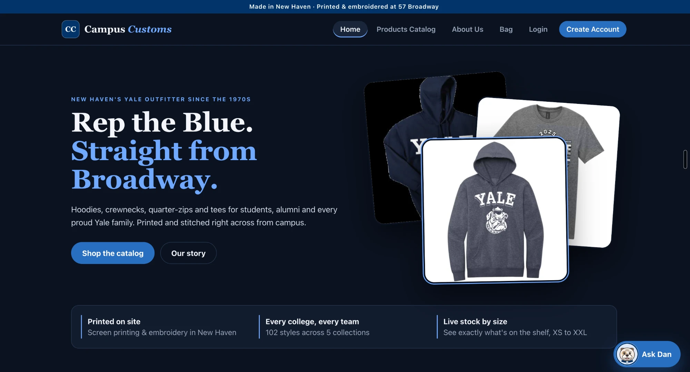
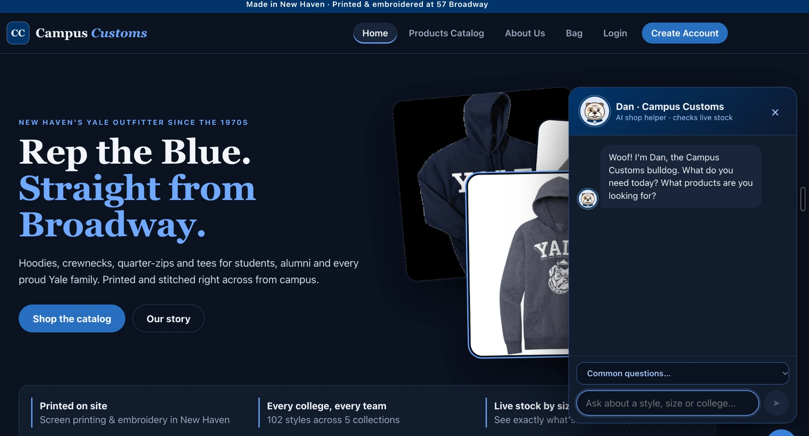
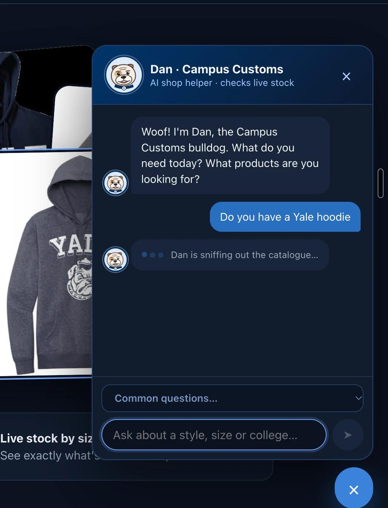
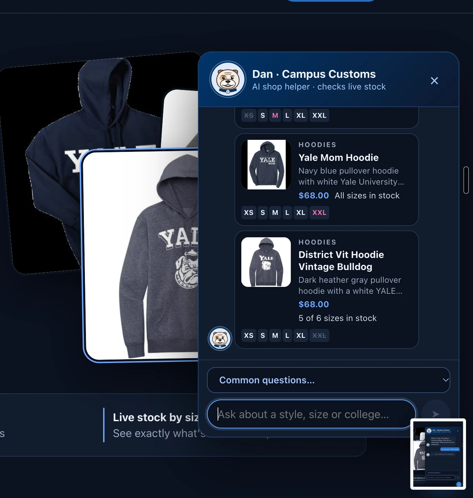
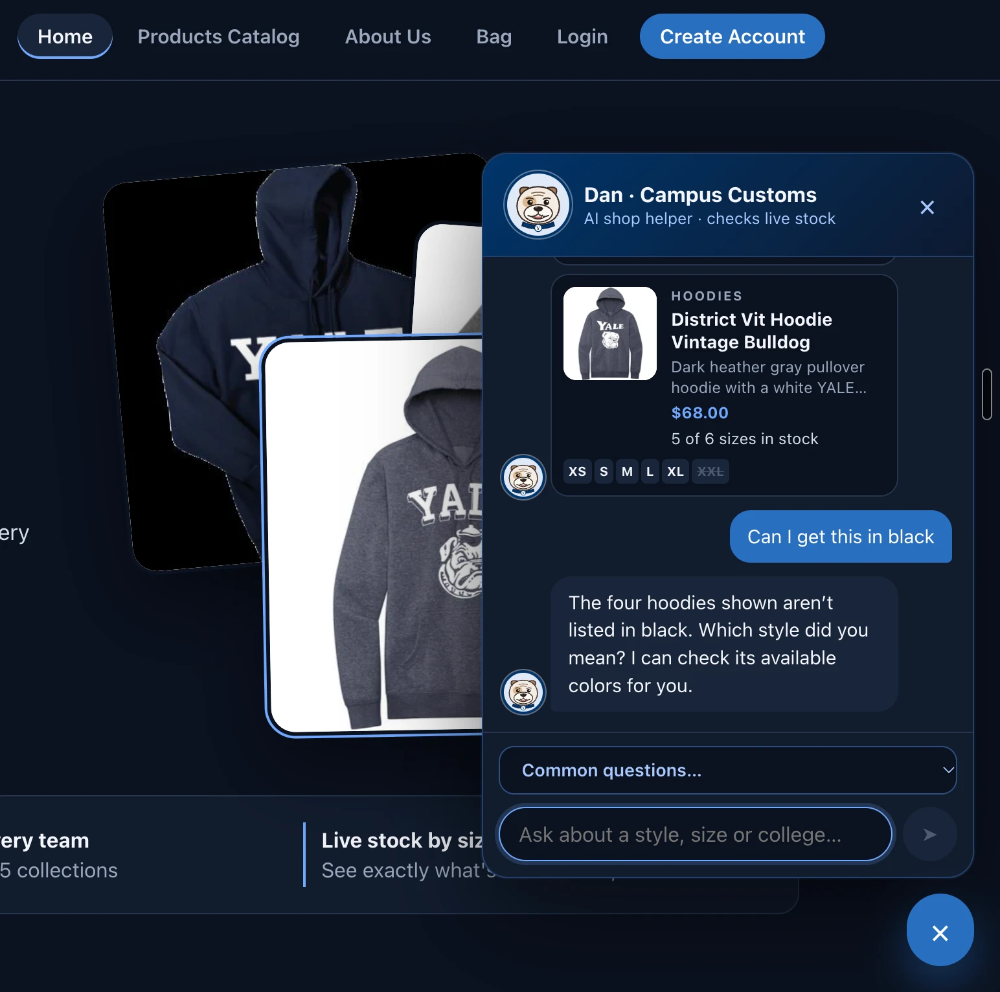
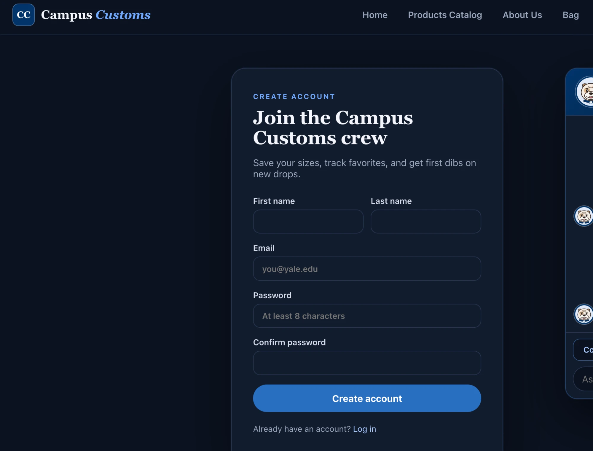
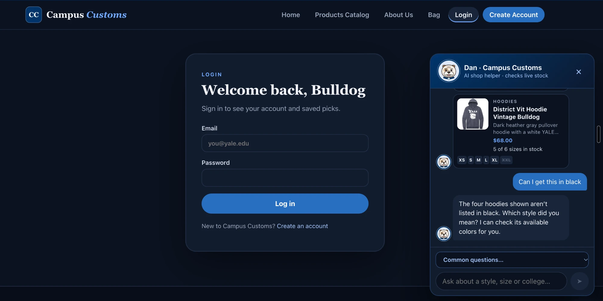

# Problem 11: Live testing of the Campus Customs app

**Result: 67 of 67 checks passed** (0 failed, 0 skipped). Run 2026-10-07 23:35, 81 s.

Full report with every expected/actual value and screenshots: [app_check.html](app_check.html).

## How it was tested

- `scripts/app_check.py` starts its own copy of the full stack (FastAPI backend + React website + the real `gpt-6-luna` AI via Portkey) on a **temporary copy of the database**, so the test account, chats, bag and reservation it creates never touch the real data.
- Headless Chrome clicks through the site like a shopper; prices and stock in answers and on cards are compared with the database.
- It also smoke-tests the servers you run yourself (guest-only), and runs the backend unit tests.
- Re-run from the `hw 4` folder: `.venv/bin/python scripts/app_check.py` (rewrites this file and the HTML report).
- Try it yourself: from the `hw 4` folder run `cd backend && ../.venv/bin/uvicorn main:app --reload --port 8000` in one terminal and `cd frontend && npm run dev` in another, then open **http://localhost:5173**.

## Results by area

| Area | Passed |
|---|---|
| 1. Platform & security | 10/10 |
| 2. Shop pages (work without the AI) | 8/8 |
| 3. Accounts & passwords | 8/8 |
| 4. AI agent answers (real gpt-6-luna, guest) | 9/9 |
| 5. Chat widget with Dan the bulldog (guest) | 8/8 |
| 6. Saved chat history & who's chatting (logged in) | 4/4 |
| 7. Bag & reserve for pickup | 7/7 |
| 8. Yale-blue design & mobile | 5/5 |
| 9. Agent audit trail | 4/4 |
| 10. Your running servers (guest-only smoke test) | 3/3 |
| 11. Backend unit tests | 1/1 |

## Live site screenshots

Taken on the running site (http://localhost:5173) and saved in `outputs/app_check_images/`. They are also linked from [app_check.html](app_check.html).

### 1. Home page in Yale Blue, with "Ask Dan"

The redesigned home page: Yale Blue announcement bar and buttons, light-blue headline, real product photos, the three store promises, and the bulldog "Ask Dan" chat button in the corner.

*Built in: Problem 3 (React site and tabs), Problem 10 (Yale-blue theme and Dan the bulldog)*

### 2. Dan greets the shopper

Opening the chat: Dan's avatar in the Yale Blue header and his greeting, "Woof! I'm Dan, the Campus Customs bulldog. What do you need today? What products are you looking for?", plus the Common questions dropdown.

*Built in: Problem 5 (AI chatbot, greeting and dropdown), Problem 10 (bulldog mascot drawn in code)*

### 3. "Do you have a Yale hoodie": Dan is looking it up

While the real AI agent searches the live database, Dan tilts his head with "Dan is sniffing out the catalogue…", so the shopper knows something is happening.

*Built in: Problem 6 (agent tools that query the database), Problem 10 (thinking bulldog)*

### 4. Live product cards in the chat

Dan answers with real product cards (Yale Mom Hoodie, District Vit Hoodie Vintage Bulldog…): photo, category, short description, $68.00 from the catalogue, "All sizes in stock" / "5 of 6 sizes in stock", sold-out sizes crossed out, and low-stock sizes in pink.

*Built in: Problem 6 (never-invented prices and stock), Problem 7 (API contract: structured product cards), Problem 9 (clickable size chips)*

### 5. "Can I get this in black": Dan understands the context

After showing four hoodies, the shopper asks about "this". Dan knows which cards were on screen, checks their real colors, says none come in black, and asks which style they meant instead of guessing.

*Built in: Problem 8 (the agent sees the cards and page the shopper saw), Problem 9 (rules for what "this" means), Problem 6 (colors from the database)*

### 6. Create Account

The account sign-up form (first and last name, email, password and confirm). New accounts are saved to the users table with securely hashed passwords. The chat stays available on the right.

*Built in: Problem 4 (accounts with PBKDF2-hashed passwords, password rules, lockout)*

### 7. Login, with the conversation still open

"Welcome back, Bulldog" login page. The chat panel keeps the conversation (hoodie card and the black-color answer) while the shopper moves between pages. After login it would be saved to their account and reload on their next visit.

*Built in: Problem 4 (login and sessions), Problem 8 (saved chat history for logged-in shoppers), Problem 7 (shop pages and chat work independently)*
